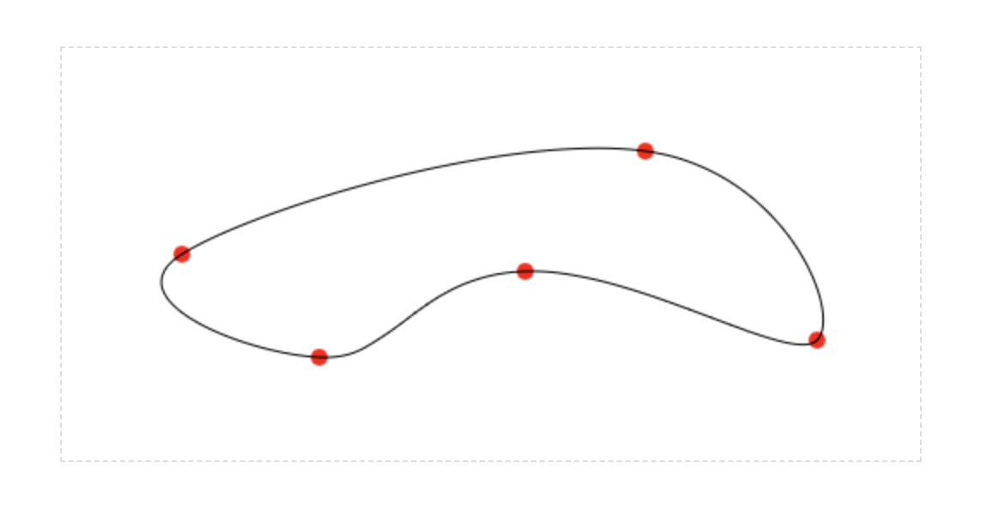
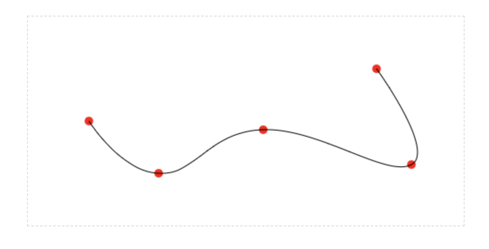

## bezier curve interpolation

> make it smooth

### install

` npm install bezier-interpolation `


### run

```

const convert = require('bezier-interpolation');
const points = [{ x: 70, y: 120 }, { x: 150, y: 180 }, { x: 270, y: 130 }, { x: 440, y: 170 }, { x: 400, y: 60 }];
const params = convert(points);
console.log(params);

```

[demo](demo/)



