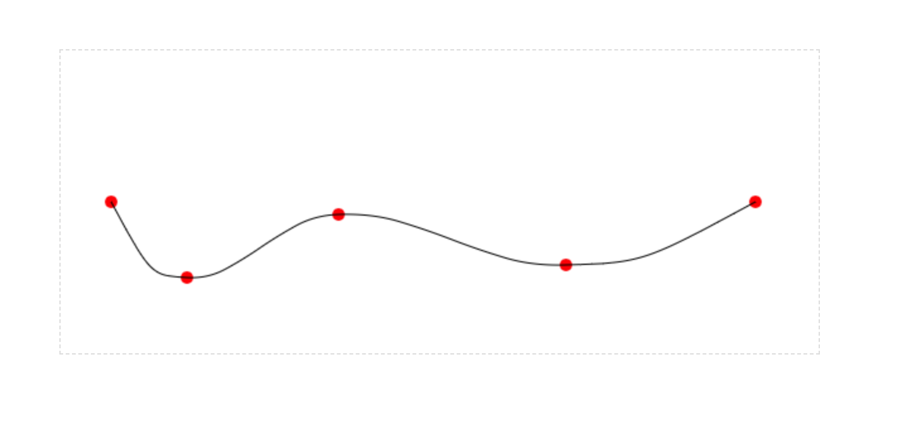

## bezier curve interpolation

> make it smooth

### install

` npm install bezier-interpolation `


### run

```

const convert = require('bezier-interpolation');
const points = [{ x: 40, y: 120 }, { x: 100, y: 180 }, { x: 220, y: 130 }, { x: 400, y: 170 }, { x: 550, y: 120 }];
const params = convert(points);
console.log(params);

```

[demo](demo/)

